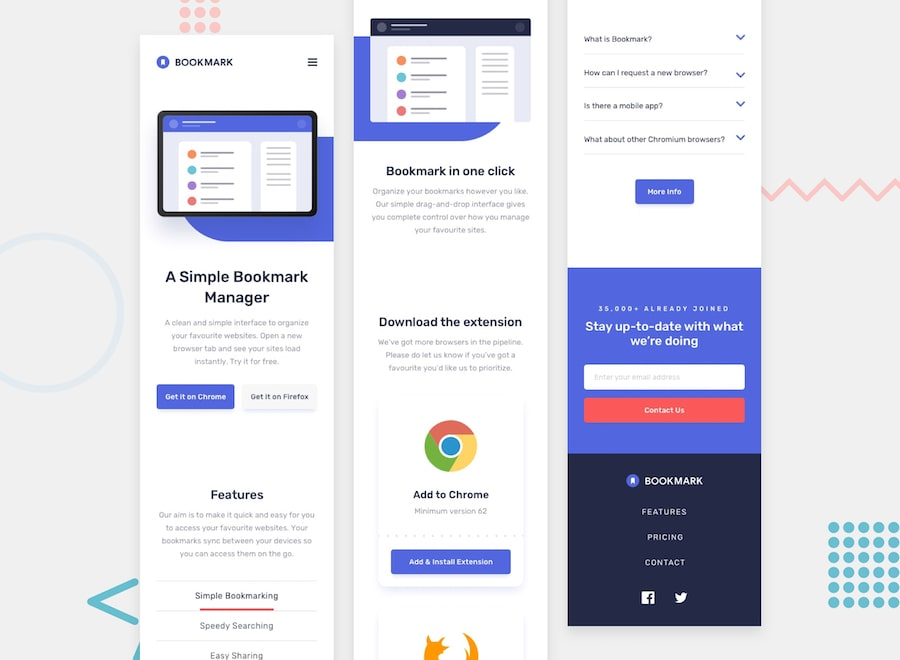
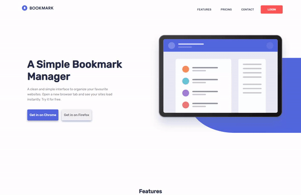
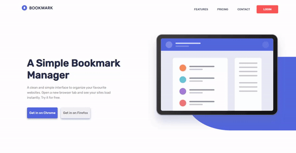
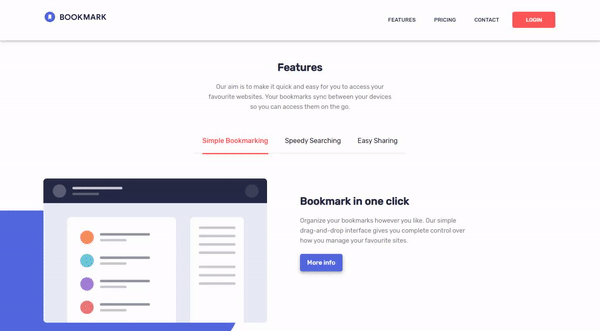
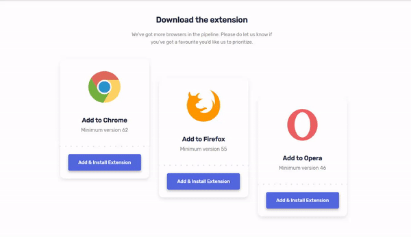
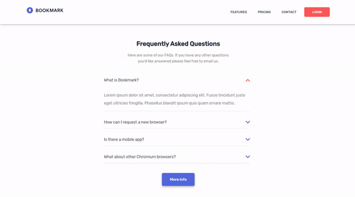
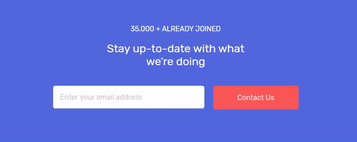

# Frontend Mentor - Bookmark landing page

  

## Mobile version preview

## Desktop version preview

To view the project recreated by me, visit: https://bookmarking-landing-page.now.sh

## The challenge

- This challenge consist to build out this landing page and get it looking as close to the design as possible.

  The users should be able to:

  - View the optimal layout for the site depending on their device's screen size
  - See hover states for all interactive elements on the page
  - Receive an error message when the newsletter form is submitted if:
    - The input field is empty
    - The email address is not formatted correctly

  For this challenge i needed to:

  - Create the rounded blue background shape with code
  - Change the `fill` and `stroke` color of the SVGs at specific points (the challenge can be completed using the single `logo-bookmark.svg` file provided)

## Installation

1. Clone this repository to your machine

2. Open the project and run

   - With npm `$ npm install`
   - With yarn `$ yarn`

3. Open it in your browser

   

## Thanks

[Frontend Mentor](https://www.frontendmentor.io/) for this challenge and [Bookmark landing page](https://www.frontendmentor.io/challenges/bookmark-landing-page-5d0b588a9edda32581d29158) design resources

## License

All the code available under the MIT + Apache 2.0. licenses. See [LICENSE](https://github.com/joaopaulogn/frontend-mentor-landing-page/blob/master/LICENSE).